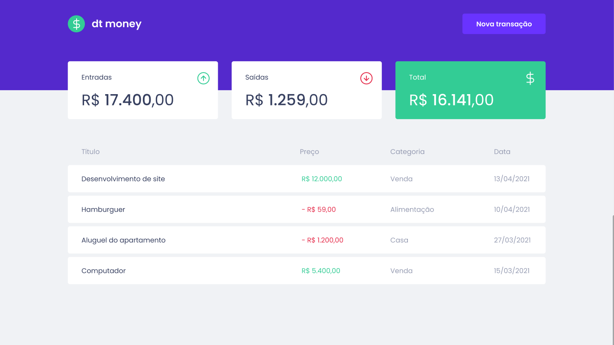
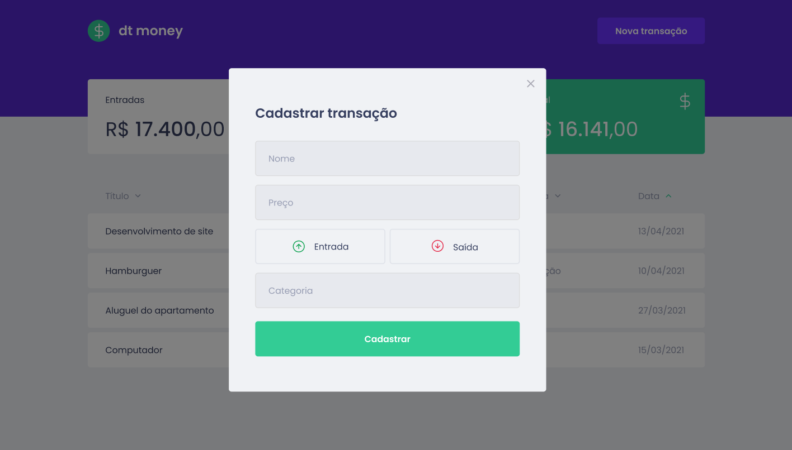

# DT Money

É uma aplicação de controle de finanças pessoais.

---

## 🚀 Tecnologias

Esse projeto foi desenvolvido com as seguintes tecnologias:

- [TypeScript](https://www.typescriptlang.org/)
- [React](https://reactjs.org)
- [Styled Components](https://styled-components.com/)
- [Mirage](https://miragejs.com/)
- [Axios](https://axios-http.com/docs/intro)

---

## 💻 Como executar

- Clone o repositório
- Entre na pasta **dtmoney** e instale as dependências utilizando `npm install` ou `yarn`
- Rode o comando `yarn start`

---

## 📚 Ferramentas, Bibliotecas e Pacotes

- **MirageJS:** construir uma API fake dentro do nosso front-end. 
  > Tem banco de dados integrados, conseguimos fazer relacionamentos. É como se fosse um framework em cima dessa parte de criar mocks em APIs (back-end)

- [**React Modal**](https://github.com/reactjs/react-modal)

## 📚 Extensões do VSCode

- vscode-styled-components